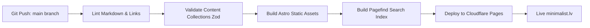

# Proposal 01: Технический стек и архитектура сайта minimalist.lv

## 1. Введение и цели проекта

Проект **minimalist.lv** — это независимый мультиязычный портал и база знаний, посвященная философии, практикам и инструментам минимализма (в жизни, цифровой среде, потреблении и технологиях).

### Ключевые требования:
- **100% Статический сайт (SSG):** максимальная скорость, отсутствие уязвимостей backend-части, нулевая стоимость базового хостинга.
- **Content-as-Code:** весь контент хранится в Git-репозитории в формате Markdown / MDX.
- **Мультиязычность (i18n):**
  - Базовый язык: **English (`en`)**
  - Обязательные локали: **Русский (`ru`)**, **Латышский (`lv`)**
  - Архитектурная готовность к добавлению других европейских языков (`de`, `fr`, `es` и т.д.).
- **Каталог инструментов в стиле PrivacyGuides.org:** структурированные карточки рекомендаций со строгими критериями отбора, бейджами, тегами и фильтрами.
- **Дизайн в стиле радикального/элегантного минимализма:** идеальная типографика, отсутствие мусора, сверхбыстрая загрузка (Lighthouse 100/100), темная/светлая тема, поддержка чтения без отвлечений.

---

## 2. Сравнительный анализ генераторов статических сайтов (SSG)

| Критерий | **Astro + Starlight / Custom Astro (Рекомендуется)** | **Hugo** | **MkDocs (Material)** | **Docusaurus** |
| :--- | :--- | :--- | :--- | :--- |
| **Язык / Экосистема** | TypeScript / Node.js / Vite | Go (Go binary) | Python | TypeScript / React |
| **Поддержка i18n** | Встроенная первоклассная поддержка маршрутизации и UI-словарей | Встроенная мультиязычность через каталоги файлов | Через плагины (mkdocs-static-i18n) | Встроенная поддержка |
| **Кастомизация UI/UX** | Максимальная (любые UI-компоненты: Vanilla, Svelte, React) | Ограничена шаблонизатором Go templates | Жесткий шаблон документации | React-компоненты |
| **Zero JS по умолчанию** | **Да (Islands Architecture)** — чистый HTML+CSS, JS только где нужен интерактив | Да | Нет (тяжелый клиентский JS) | Нет (SPA hydration) |
| **Каталог инструментов (как Privacy Guides)** | Идеально через Content Collections + схемы Zod | Возможно, но сложнее в шаблонах | Ограничено структурой доки | Возможно, но медленнее билд |
| **Полнотекстовый поиск** | Pagefind (локальный, статический, мультиязычный) | Lunr / Algolia | Встроенный Lunr | Algolia / Local search |

### 🏆 Рекомендованный выбор: **Astro 4+ / 5 (с Astro Content Collections)**

**Почему именно Astro:**
1. **Zero Client-Side JavaScript by default:** полностью соответствует философии сайта. Страницы статей и блога отдаются чистым HTML+CSS.
2. **Типобезопасность контента (Content Collections + Zod):** строгая валидация frontmatter для каталога программ (лицензии, ссылки, платформы, теги) и блога.
3. **Нативная архитектура i18n:** встроенная маршрутизация (`/en/`, `/ru/`, `/lv/`), резервные языки (fallbacks), независимые URL-структуры.
4. **Легковесный мультиязычный поиск:** интеграция с **Pagefind** (индексирует статический HTML на этапе сборки, не требует серверов, весит единицы килобайт, поддерживает морфологию разных языков).

---

## 3. Архитектура мультиязычности (i18n)

### 3.1. Структура маршрутизации URL
- `minimalist.lv/en/` — Английская версия (Default)
- `minimalist.lv/ru/` — Русская версия
- `minimalist.lv/lv/` — Латышская версия
- Корневой URL `minimalist.lv/` — автоматический редирект на основе заголовка браузера `Accept-Language` или сохраненного выбора пользователя, с fallback на `/en/`.

### 3.2. Соответствие путей и связывание переводов
Каждая страница и статья имеет уникальный `id` (или slug-ключ), связывающий все языковые версии через теги `<link rel="alternate" hreflang="..." />` для идеального SEO:

```text
/en/tools/text-editors/       <-->   /ru/tools/text-editors/       <-->   /lv/tools/text-editors/
/en/blog/digital-declutter/   <-->   /ru/blog/digital-declutter/   <-->   /lv/blog/digital-declutter/
/en/guides/minimalist-home/   <-->   /ru/guides/minimalist-home/   <-->   /lv/guides/minimalist-home/
```

### 3.3. Логика отсутствующих переводов (Fallback strategy)
Если статья еще не переведена на латышский или русский язык:
- В интерфейсе выводится ненавязчивый информационный баннер: *"Этот материал пока не переведен на ваш язык. Показана версия на английском"*.
- В шапке доступна плашка *"Помочь с переводом на GitHub"*.

---

## 4. Структура репозитория и организация контента

```text
minimalist/
├── .github/
│   └── workflows/
│       ├── deploy.yml            # CI/CD: сборка и деплой на Cloudflare Pages / GitHub Pages
│       ├── lint-markdown.yml     # Проверка синтаксиса Markdown и битых ссылок
│       └── i18n-coverage.yml     # Отчет о покрытии переводами
├── public/
│   ├── favicon.svg
│   ├── fonts/                    # Локальные оптимизированные вариативные шрифты (woff2)
│   └── robots.txt
├── src/
│   ├── assets/                   # Оптимизируемые изображения и векторная графика
│   ├── components/
│   │   ├── core/                 # Базовые UI-компоненты (Header, Footer, LanguagePicker)
│   │   ├── tools/                # Карточки софта (ToolCard, CriteriaBadge, PlatformIcons)
│   │   ├── blog/                 # Список постов, карточка поста, метаданные (время чтения)
│   │   └── common/               # Поиск (Pagefind UI), переключатель тем, оглавление (TOC)
│   ├── content/
│   │   ├── config.ts             # Zod-схемы валидации Frontmatter
│   │   ├── guides/               # 20 фундаментальных статей базы знаний
│   │   │   ├── en/
│   │   │   ├── ru/
│   │   │   └── lv/
│   │   ├── blog/                 # 54 еженедельных статьи блога
│   │   │   ├── en/
│   │   │   ├── ru/
│   │   │   └── lv/
│   │   └── tools/                # Каталог инструментов и программ
│   │       ├── categories/       # Описания категорий (текстовые редакторы, ОС и др.)
│   │       └── items/            # YAML/MDX карточки каждого инструмента
│   ├── i18n/
│   │   ├── ui.ts                 # UI-строки интерфейса (кнопки, навигация, лейблы)
│   │   └── utils.ts              # Хелперы локализации и роутинга
│   ├── layouts/
│   │   ├── BaseLayout.astro      # Общий HTML shell (SEO, Meta, Alternate links)
│   │   ├── GuideLayout.astro     # Макет для статей базы знаний с оглавлением (TOC)
│   │   ├── BlogLayout.astro      # Макет для постов блога
│   │   └── ToolCategoryLayout.astro # Макет для каталога софта
│   ├── pages/
│   │   ├── [lang]/
│   │   │   ├── index.astro       # Главная страница для каждой локали
│   │   │   ├── guides/           # Страницы базы знаний
│   │   │   ├── blog/             # Список и страницы блога
│   │   │   ├── tools/            # Разделы каталога инструментов
│   │   │   └── about.astro       # О проекте, манифест и критерии отбора
│   │   └── index.astro           # Корневой роут для редиректа по языку
│   └── styles/
│       ├── global.css            # Минималистичные CSS-переменные (типографика, цвета, отступы)
│       └── typography.css        # Выверенные стили для комфортного лонгрид-чтения
├── astro.config.mjs              # Конфигурация Astro + i18n + Pagefind
├── package.json
├── tsconfig.json
└── README.md
```

---

## 5. Схемы данных контента (Content Collections Schemas)

Использование **Astro Content Collections** гарантирует строгую проверку типов в момент сборки.

### 5.1. Схема статьи базы знаний (`guides`)
```typescript
import { defineCollection, z } from 'astro:content';

const guidesCollection = defineCollection({
  type: 'content',
  schema: z.object({
    title: z.string(),
    description: z.string().max(160),
    order: z.number(), // Порядковый номер в программе изучения
    category: z.enum(['philosophy', 'digital', 'physical', 'mindset', 'finance', 'work']),
    publishedDate: z.date(),
    updatedDate: z.date().optional(),
    readingTime: z.number(), // в минутах
    draft: z.boolean().default(false),
  }),
});
```

### 5.2. Схема поста блога (`blog`)
```typescript
const blogCollection = defineCollection({
  type: 'content',
  schema: z.object({
    title: z.string(),
    description: z.string(),
    weekNumber: z.number().min(1).max(54),
    season: z.enum(['winter', 'spring', 'summer', 'autumn']),
    publishedDate: z.date(),
    tags: z.array(z.string()),
    readingTimeMinutes: z.number().default(5),
    author: z.string().default('minimalist.lv team'),
  }),
});
```

### 5.3. Схема инструмента/программы (`tools`)
```typescript
const toolItemCollection = defineCollection({
  type: 'content',
  schema: z.object({
    name: z.string(),
    tagline: z.string(),
    category: z.string(), // text-editors, browsers, os, notes, etc.
    websiteUrl: z.url(),
    sourceCodeUrl: z.url().optional(),
    isOpenSource: z.boolean(),
    isOfflineFirst: z.boolean(),
    isZeroTelemetry: z.boolean(),
    license: z.string(),
    platforms: z.array(z.enum(['linux', 'macos', 'windows', 'android', 'ios', 'web', 'cli'])),
    recommendationStatus: z.enum(['recommended', 'notable_mention', 'experimental']),
    pros: z.array(z.string()),
    cons: z.array(z.string()),
    minimalistVerdict: z.string(), // Короткий вывод эксперта
  }),
});
```

---

## 6. Дизайн-система и UI/UX философия

### 6.1. Эстетические принципы:
1. **Monochrome / Muted Palette:** основа — глубокий черный/белый с мягкими оттенками серого (`#121212`, `#1e1e1e`, `#f8f9fa`, `#e9ecef`) и одним сдержанным акцентным цветом.
2. **Типографика как главный элемент дизайна:** 
   - Заголовки: строгий гротеск (Inter / Geist Sans / System Sans) или выразительный нео-гротеск.
   - Основной текст: высокочитабельный шрифт с поддержкой расширенной латиницы и кириллицы (Geist, Newsreader или качественный Sans-serif с оптимальным `line-height: 1.6-1.7` и `max-width: 68ch`).
3. **Никакого визуального мусора:**
   - 0 сторонних трекеров и cookie-баннеров (GDPR-friendly по умолчанию).
   - 0 агрессивных pop-up окон, всплывающих виджетов и баннеров подписки.
   - Иконки: чистый монохромный Lucide Icons или Tabler Icons (inline SVG).
4. **Быстродействие и доступность:**
   - Perfect Lighthouse Score: 100/100/100/100 (Performance, Accessibility, Best Practices, SEO).
   - Поддержка `prefers-color-scheme`, переключатель темы без моргания экрана (Zero-layout shift).

---

## 7. Инфраструктура, CI/CD и деплой

### 7.1. Хостинг и доставка (Edge CDN)
- **Рекомендуемый хостинг:** **Cloudflare Pages** (или GitHub Pages + Cloudflare DNS / Vercel).
  - Глобальная Edge-сеть (минимальный TTFB в Латвии, Европе и по всему миру).
  - Автоматическая генерация SSL-сертификатов.
  - Бесплатный тариф покрывает миллионы запросов без ограничений.
  - Поддержка кастомного домена `minimalist.lv` и субдоменов.

### 7.2. Pipeline непрерывной интеграции (GitHub Actions)


### 7.3. Полнотекстовый поиск (Pagefind)
- На этапе сборки запускается `npx pagefind --site dist`.
- Создаются чанки поискового индекса, разделенные по языкам (`en`, `ru`, `lv`).
- Поиск работает мгновенно в браузере пользователя, не требует Node/Postgres/Algolia серверов.

---

## 8. Процесс локализации и совместной работы (i18n Workflow)

1. **Базовый коммит на английском:** автор публикует или обновляет материал в `src/content/.../en/`.
2. **Синхронизация переводов:**
   - Использование **Weblate** (Open Source платформа переводов) или интеграция через GitHub PRs.
   - Специальный скрипт `npm run i18n:status` в CI показывает процент переведенных файлов для `ru` и `lv`.
3. **Стандарты перевода терминологии:**
   - Создание глоссария минималистичных терминов (например, *decluttering* -> *расхламление / atbrīvošanās no liekā*, *digital wellness* -> *цифровое благополучие / digitālā labbūtība*).
