# Proposal 02: Структура базовой базы знаний (20 фундаментальных статей)

Базовая база знаний (Core Knowledge Base / Guides) проекта **minimalist.lv** представляет собой структурированный курс-руководство из **20 фундаментальных статей**, разделенных на 6 ключевых направлений.

Каждая статья — это исчерпывающий, структурированный лонгрид (время чтения 8–15 минут), содержащий теоретическую базу, пошаговые инструкции, научные исследования и практические чек-листы.

---

## 🗺️ Обзор разделов и структуры

```mermaid
graph TD
    Root[База знаний minimalist.lv] --> P1[Модуль 1: Основы и философия]
    Root --> P2[Модуль 2: Физическое пространство]
    Root --> P3[Модуль 3: Цифровой минимализм]
    Root --> P4[Модуль 4: Осознанные финансы]
    Root --> P5[Модуль 5: Ментальное пространство и время]
    Root --> P6[Модуль 6: Работа и продуктивность]

    P1 --> A1[01. Манифест минимализма]
    P1 --> A2[02. История и школы мысли]
    P1 --> A3[03. Мифы и крайности]
    P1 --> A4[04. Определение личных ценностей]

    P2 --> A5[05. Методология расхламления]
    P2 --> A6[06. Организация пространства без накопления]
    P2 --> A7[07. Капсульный гардероб]
    P2 --> A8[08. Zero Waste и устойчивость]

    P3 --> A9[09. Принципы цифровой гигиены]
    P3 --> A10[10. Смартфон как инструмент]
    P3 --> A11[11. Наведение порядка в файлах и облаках]
    P3 --> A12[12. Информационная диета]

    P4 --> A13[13. Психология потребления]
    P4 --> A14[14. Бюджетирование и свобода от долгов]
    P4 --> A15[15. Инвестиции в опыт вместо вещей]

    P5 --> A16[16. Искусство говорить «Нет»]
    P5 --> A17[17. Ментальный детокс и тишина]
    P5 --> A18[18. Минимализм в отношениях]

    P6 --> A19[19. Минималистичное рабочее место]
    P6 --> A20[20. Фокус, Single-Tasking и глубокая работа]
```

---

## 📚 Детальный план 20 фундаментальных статей

---

### МОДУЛЬ 1: ФИЛОСОФИЯ И ОСНОВЫ (Articles 01–04)

#### Статья 01. Манифест минимализма: Освобождение места для важного
- **Slugs:**
  - EN: `/en/guides/01-minimalism-manifesto/`
  - RU: `/ru/guides/01-manifest-minimalizma/`
  - LV: `/lv/guides/01-minimālisma-manifests/`
- **Цель:** Дать точное и современное определение минимализма как инструмента повышения качества жизни, а не как самоцели или культа лишений.
- **Основные тезисы и структура:**
  1. Что такое минимализм: вычитание несущественного ради усиления главного.
  2. Концепция интенциональности (Intentional Living) — осознанный выбор в каждой сфере.
  3. Прямая связь между избытком вещей/информации и уровнем кортизола (стресса).
  4. Главное правило: минимализм индивидуален (не существует жесткого лимита в 100 вещей).
- **Практический результат:** Формулирование собственного определения минимализма и аудит зон перегрузки.

---

#### Статья 02. Корни и эволюция: От стоиков и дзен до современного мира
- **Slugs:**
  - EN: `/en/guides/02-history-and-schools-of-thought/`
  - RU: `/ru/guides/02-istoriya-i-filosofskie-korni/`
  - LV: `/lv/guides/02-vēsture-un-filozofiskās-saknes/`
- **Цель:** Показать, что минимализм — это вековая человеческая мудрость, прошедшая путь от античной философии до ответа на общество потребления XXI века.
- **Основные тезисы и структура:**
  1. Античные корни: стоицизм (Сенека, Марк Аврелий, Эпиктет) о контроле желаний.
  2. Восточные традиции: японский дзен, концепции *Ма* (пространство между вещами) и *Ваби-саби* (красота простоты и несовершенства).
  3. Генри Дэвид Торо и эксперимент на Уолденском пруду.
  4. Архитектурный минимализм (Баухаус, Мис ван дер Роэ — «Less is more», Дитер Рамс).
  5. Современная волна как реакция на консьюмеризм и цифровую перегрузку.
- **Практический результат:** Понимание философских оснований, защищающих от сползания в поверхностный маркетинг.

---

#### Статья 03. Мифы, крайности и ловушки псевдоминимализма
- **Slugs:**
  - EN: `/en/guides/03-myths-and-traps/`
  - RU: `/ru/guides/03-mify-i-lovushki/`
  - LV: `/lv/guides/03-mīti-un-slazdi/`
- **Цель:** Разоблачить популярные заблуждения, вызывающие токсичную вину или превращающие минимализм в дорогой эстетический тренд.
- **Основные тезисы и структура:**
  1. Миф 1: «Минимализм — это только для богатых холостяков» (привилегия vs универсальный навык).
  2. Миф 2: «Нужно жить в пустой белой комнате и выбросить всё памятное».
  3. Миф 3: «Покупка новых дорогих "минималистичных" вещей вместо использования имеющихся» (эстетический консьюмеризм).
  4. Синдром перфекционизма и мания избавления от вещей (Decluttering Addiction).
- **Практический результат:** Чек-лист проверки: служит ли вам ваш минимализм или вы служите идее.

---

#### Статья 04. Аудит жизни и определение ключевых ценностей
- **Slugs:**
  - EN: `/en/guides/04-identifying-core-values/`
  - RU: `/ru/guides/04-audit-i-lichnye-cennosti/`
  - LV: `/lv/guides/04-dzīves-audits-un-vērtības/`
- **Цель:** Построить персональный ценностный компас, который будет критерием фильтрации вещей, задач, контактов и контента.
- **Основные тезисы и структура:**
  1. Почему невозможно избавиться от лишнего, пока не знаешь, что является важным.
  2. Упражнение «Колесо жизненного баланса в минимализме»: выявление зон шума.
  3. Метод сокращения ценностей: от списка из 50 слов к 3–5 фундаментальным приоритетам.
  4. Применение ценностей как фильтра: тест «Если это не абсолютное ДА, то это твердое НЕТ».
- **Практический результат:** Шаблон таблицы персонального аудита и формулировка личного кредо.

---

### МОДУЛЬ 2: ФИЗИЧЕСКОЕ ПРОСТРАНСТВО И ДОМ (Articles 05–08)

#### Статья 05. Полная методология расхламления: Пошаговый алгоритм
- **Slugs:**
  - EN: `/en/guides/05-decluttering-methodology/`
  - RU: `/ru/guides/05-metodologiya-rashlamleniya/`
  - LV: `/lv/guides/05-atbrivosanas-no-lieka-metodika/`
- **Цель:** Предоставить пошаговый алгоритм очищения любого физического пространства без паралича решений и выгорания.
- **Основные тезисы и структура:**
  1. Сравнение популярных методов: КонМари (искры радости), метод 4 коробок (Оставить, Подарить/Продать, Выбросить, Сомневаюсь), метод «Упаковочной вечеринки» (The Minimalists).
  2. Психология привязанности: как справиться с когнитивным искажением невозвратных затрат (*Sunk Cost Fallacy* — «я же заплатил за это деньги»).
  3. Работа с сентиментальными предметами и подарками: память внутри нас, а не в пластике.
  4. Маршрут расхламления: от легкого (дубликаты, мусор, одежда) к сложному (памятные вещи, документы).
- **Практический результат:** Готовая 30-дневная пошаговая карта расхламления дома по комнатам.

---

#### Статья 06. Архитектура чистого дома: Организация без накопления
- **Slugs:**
  - EN: `/en/guides/06-home-organization-systems/`
  - RU: `/ru/guides/06-arhitektura-chistogo-doma/`
  - LV: `/lv/guides/06-mājas-telpas-organizacija/`
- **Цель:** Создать самоподдерживающуюся систему порядка, исключающую повторное захламление.
- **Основные тезисы и структура:**
  1. Правило «У каждой вещи есть один единственный дом».
  2. Правило «Одно вошло — одно ушло» (One-in, One-out).
  3. Концепция плоских поверхностей (Clear Flat Surfaces) и снижение когнитивной нагрузки.
  4. Зонирование хранения: частое vs редкое использование.
  5. Организационные ловушки: почему покупка новых контейнеров и органайзеров не решает проблему избытка.
- **Практический результат:** Набор правил ежедневной 10-минутной поддержки порядка.

---

#### Статья 07. Капсульный гардероб: Универсальный подход к одежде
- **Slugs:**
  - EN: `/en/guides/07-capsule-wardrobe-guide/`
  - RU: `/ru/guides/07-kapsulnyj-garderob/`
  - LV: `/lv/guides/07-kapsulas-garderobes-celvedis/`
- **Цель:** Освободить утро от усталости от принятия решений (*decision fatigue*) и сформировать функциональный гардероб из 25–40 качественных вещей.
- **Основные тезисы и структура:**
  1. Проблема быстрой моды (*fast fashion*) и захламленных шкафов (мы носим 20% вещей 80% времени).
  2. Цветовая палитра: базовые нейтральные тона + акценты, легко сочетающиеся между собой.
  3. Выбор материалов: натуральные ткани, долговечность, легкий уход.
  4. Сезонные капсулы и проект 333 (Courtney Carver).
  5. Формула универсального гардероба для мужчин и женщин.
- **Практический результат:** Матрица сочетаемости и чек-лист для сборки персональной капсулы на сезон.

---

#### Статья 08. Минимализм и устойчивость: Zero Waste и циклическая экономика
- **Slugs:**
  - EN: `/en/guides/08-sustainable-minimalism-zero-waste/`
  - RU: `/ru/guides/08-minimalizm-i-ekologiya-zero-waste/`
  - LV: `/lv/guides/08-ilgtspejigs-minimalisms-zero-waste/`
- **Цель:** Объединить минимализм с заботой об экологии: куда девать ненужное экологично и как перестать генерировать отходы.
- **Основные тезисы и структура:**
  1. Иерархия 5R: Refuse (Откажись), Reduce (Сократи), Reuse (Используй повторно), Rot (Компостируй), Recycle (Переработай).
  2. Экологичная утилизация ненужных вещей: шеринг-платформы, комиссионки, донейты, переработка электроники в ЕС и странах Балтии.
  3. Переход на многоразовые альтернативы в быту.
  4. Ремонт и поддержание вещей в идеальном состоянии вместо покупки замены.
- **Практический результат:** Карта экологичной утилизации и каталог долговечных альтернатив одноразовым вещам.

---

### МОДУЛЬ 3: ЦИФРОВОЙ МИНИМАЛИЗМ И ТЕХНОЛОГИИ (Articles 09–12)

#### Статья 09. Принципы цифровой гигиены и автономии
- **Slugs:**
  - EN: `/en/guides/09-digital-hygiene-principles/`
  - RU: `/ru/guides/09-principy-cifrovoj-gigieny/`
  - LV: `/lv/guides/09-digitalas-higienas-pamatprincipi/`
- **Цель:** Сформировать философскую и техническую базу отношений с современными цифровыми устройствами.
- **Основные тезисы и структура:**
  1. Концепция Cal Newport (Digital Minimalism): технологии должны служить вашим ценностям, а не выкачивать внимание.
  2. Экономика внимания и алгоритмы соцсетей как фабрика дофаминовой зависимости.
  3. Принцип минимальной цифровой поверхности (Digital Attack & Distraction Surface).
  4. Local-First и открытые форматы данных: владение собственной информацией.
- **Практический результат:** Декларация цифровой независимости и аудит экранного времени.

---

#### Статья 10. Смартфон как полезный инструмент, а не слот-машина
- **Slugs:**
  - EN: `/en/guides/10-minimalist-smartphone-setup/`
  - RU: `/ru/guides/10-minimalistichnyj-smartfon/`
  - LV: `/lv/guides/10-minimalistisks-viedtalrunis/`
- **Цель:** Превратить смартфон из источника компульсивных отвлечений в спокойный швейцарский нож для решения задач.
- **Основные тезисы и структура:**
  1. Радикальная настройка уведомлений: разрешены только прямые сообщения от живых людей.
  2. Очищение домашнего экрана: пустой главный экран, поиск Spotlight/App Drawer вместо иконок-приманок.
  3. Черно-белый режим (Grayscale) как инструмент снятия дофаминовой тяги.
  4. Удаление бесконечных лент (соцсети только через браузер на десктопе).
  5. Физические границы: спальня без телефона, утренние и вечерние часы офлайн.
- **Практический результат:** Пошаговая инструкция по настройке iOS и Android в минималистичном режиме.

---

#### Статья 11. Наведение порядка в файлах, облаках и цифровом архиве
- **Slugs:**
  - EN: `/en/guides/11-organizing-files-and-cloud-storage/`
  - RU: `/ru/guides/11-poryadok-v-fajlah-i-oblakah/`
  - LV: `/lv/guides/11-kartiba-failos-un-makondatos/`
- **Цель:** Выстроить простую и надежную структуру папок, фотоархивов и облачных хранилищ.
- **Основные тезисы и структура:**
  1. Системы структурирования: PARA метод (Projects, Areas, Resources, Archive) и Johnny Decimal.
  2. Принцип плоской структуры и мощного поиска вместо ветвистых 10-уровневых папок.
  3. Фотоархивы: от 50 000 дубликатов к тщательно отобранным альбомам лучших воспоминаний.
  4. Правило резервного копирования 3-2-1 в минималистичном исполнении.
  5. Отписка от спама и очистка почтовых ящиков (Inbox Zero).
- **Практический результат:** Шаблон универсальной файловой структуры и алгоритм чистки облаков за 1 вечер.

---

#### Статья 12. Информационная диета и управление входящим потоком
- **Slugs:**
  - EN: `/en/guides/12-low-information-diet/`
  - RU: `/ru/guides/12-informacionnaya-dieta/`
  - LV: `/lv/guides/12-zemu-informacijas-paterejuma-dieta/`
- **Цель:** Научиться фильтровать новостной шум, кликбейт и думскроллинг, оставаясь адекватно информированным.
- **Основные тезисы и структура:**
  1. Концепция низкоинформационной диеты (Тим Феррис, Рольф Добелли «Stop Reading the News»).
  2. RSS-ридеры и медленное чтение (Read-it-later) вместо бесконечных алгоритмических лент.
  3. Правило «Знание высокой плотности» (книги и фундаментальные статьи против сиюминутных твитов).
  4. Ограничение каналов коммуникации: сокращение количества мессенджеров и чатов.
- **Практический результат:** Настроенный персональный фильтр входящей информации и RSS-клиент.

---

### МОДУЛЬ 4: ОСОЗНАННЫЕ ФИНАНСЫ И ПОТРЕБЛЕНИЕ (Articles 13–15)

#### Статья 13. Психология потребления: Как победить импульсивные покупки
- **Slugs:**
  - EN: `/en/guides/13-psychology-of-consumption/`
  - RU: `/ru/guides/13-psihologiya-potrebleniya/`
  - LV: `/lv/guides/13-paterina-psihologija/`
- **Цель:** Понять маркетинговые триггеры, вызывающие непреодолимое желание покупать, и выработать защитные рефлексы.
- **Основные тезисы и структура:**
  1. Гедонистическая беговая дорожка (*Hedonic Treadmill*) и кратковременность радости от покупок.
  2. Эффект Дидро: как одна новая вещь провоцирует цепную реакцию покупок других вещей.
  3. Правило 72 часов и список отложенных желаний (Wishlist buffer).
  4. Расчет стоимости вещи в часах вашей жизни и труда.
- **Практический результат:** Алгоритм 5 вопросов перед любой покупкой дороже 20 евро.

---

#### Статья 14. Минималистичное бюджетирование и финансовая автономия
- **Slugs:**
  - EN: `/en/guides/14-minimalist-budgeting-financial-freedom/`
  - RU: `/ru/guides/14-minimalistichnoe-byudzhetirovanie/`
  - LV: `/lv/guides/14-minimalistisks-budzets-un-briviba/`
- **Цель:** Избавиться от сложного ручного учета каждой копейки и построить простую автоматизированную систему накоплений.
- **Основные тезисы и структура:**
  1. Почему сложные финансовые приложения бросают 90% людей.
  2. Правило 50/30/20 и система «Pay Yourself First» (Заплати сначала себе).
  3. Аудит и беспощадная отмена скрытых подписок и регулярных платежей.
  4. Подушка безопасности (Emergency Fund) как высшая форма минималистичной роскоши — покупка спокойствия.
  5. Минимализм и движение FIRE (Financial Independence, Retire Early).
- **Практический результат:** Шаблон простого одностраничного бюджета в таблице или plain text.

---

#### Статья 15. Инвестиции в опыт и развитие вместо материальных объектов
- **Slugs:**
  - EN: `/en/guides/15-investing-in-experiences-not-things/`
  - RU: `/ru/guides/15-investicii-v-opyt-vmesto-veshchej/`
  - LV: `/lv/guides/15-investicijas-pieredze-nevis-lietas/`
- **Цель:** Переориентировать финансовые ресурсы на создание воспоминаний, навыков, здоровья и социального капитала.
- **Основные тезисы и структура:**
  1. Научные данные Томаса Гиловича (Корнеллский университет): почему опыт приносит долгосрочное счастье, а вещи — нет.
  2. Память не занимает физического места и не требует уборки.
  3. Вложения в физическое здоровье, качественный сон и качественную простую еду.
  4. Обучение навыкам самостоятельности (DIY, кулинария, базовый ремонт).
- **Практический результат:** Составление личного «Списка жизненного опыта» вместо вишлиста покупок.

---

### МОДУЛЬ 5: МЕНТАЛЬНОЕ ПРОСТРАНСТВО, ВРЕМЯ И ОТНОШЕНИЯ (Articles 16–18)

#### Статья 16. Искусство говорить «Нет»: Расхламление календаря и обязательств
- **Slugs:**
  - EN: `/en/guides/16-saying-no-calendar-decluttering/`
  - RU: `/ru/guides/16-iskusstvo-govorit-net-i-kalendar/`
  - LV: `/lv/guides/16-maksla-pateikt-ne-un-kalendars/`
- **Цель:** Освободить драгоценное время от чужих приоритетов, навязанных встреч и токсичных обязательств.
- **Основные тезисы и структура:**
  1. Эссенциализм Грега МакКеона: если вы не расставите приоритеты в своей жизни, кто-то другой сделает это за вас.
  2. Техники вежливого, но твердого отказа без чувства вины.
  3. Концепция пустого пространства в календаре (White Space) для отдыха и спонтанности.
  4. Аудит обязательств: регулярная ревизия того, что вы делаете «по привычке».
- **Практический результат:** Готовые скрипты вежливых отказов для работы и личной жизни.

---

#### Статья 17. Ментальный детокс: Практика тишины, созерцания и замедления
- **Slugs:**
  - EN: `/en/guides/17-mental-clarity-solitude-and-silence/`
  - RU: `/ru/guides/17-mentalnyj-detoks-i-tishina/`
  - LV: `/lv/guides/17-gariga-skaidriba-un-klusums/`
- **Цель:** Вернуть способность находиться наедине со своими мыслями без постоянной внешней стимуляции наушниками или экранами.
- **Основные тезисы и структура:**
  1. Ценность уединения (*Solitude Deprivation*): почему современный мозг разучился скучать.
  2. Прогулки без телефона и подкастов как лучший генератор творческих идей.
  3. Простое ведение дневника (Journaling / Brain Dump) для выгрузки тревог на бумагу.
  4. Движение Slow Living: осознанное замедление темпа жизни в эпоху вечной спешки.
- **Практический результат:** Практика 30 минут ежедневной сенсорной тишины.

---

#### Статья 18. Минимализм в отношениях: Качество вместо количества
- **Slugs:**
  - EN: `/en/guides/18-minimalism-in-relationships/`
  - RU: `/ru/guides/18-minimalizm-v-otnosheniyah/`
  - LV: `/lv/guides/18-minimalisms-attiecibas/`
- **Цель:** Построить глубокие и доверительные связи с близкими людьми, избавившись от поверхностных и истощающих контактов.
- **Основные тезисы и структура:**
  1. Число Данбара и ограничения нашей социальной емкости.
  2. Распознавание токсичных и односторонних связей, ворующих энергию.
  3. Фокус на близком круге (семья, 3–5 настоящих друзей).
  4. Искусство качественного присутствия (*Undivided Attention*) во время общения.
- **Практический результат:** Упражнение по экологичному сокращению контактов в соцсетях и мессенджерах.

---

### МОДУЛЬ 6: РАБОТА, РАБОЧЕЕ МЕСТО И ПРОДУКТИВНОСТЬ (Articles 19–20)

#### Статья 19. Минималистичное рабочее место: Эргономика и свобода от отвлечений
- **Slugs:**
  - EN: `/en/guides/19-minimalist-desk-and-workspace/`
  - RU: `/ru/guides/19-minimalistichnoe-rabochee-mesto/`
  - LV: `/lv/guides/19-minimalistiska-darba-vieta/`
- **Цель:** Оборудовать чистое, эстетичное и функциональное физическое рабочее пространство для домашнего офиса или работы на выезде.
- **Основные тезисы и структура:**
  1. Философия чистого стола (Clean Desk Policy) в конце каждого рабочего дня.
  2. Кабель-менеджмент: устранение визуального шума проводов.
  3. Качественная база: надежный стол, эргономичное кресло, правильный монитор и свет.
  4. Концепция мобильного офиса: один легкий ноутбук и компактное зарядное устройство.
- **Практический результат:** Чек-лист оптимизации домашнего рабочего места за 5 шагов.

---

#### Статья 20. Фокус и глубокая работа: Продуктивность через сокращение
- **Slugs:**
  - EN: `/en/guides/20-deep-work-and-single-tasking/`
  - RU: `/ru/guides/20-fokus-i-glubokaya-rabota/`
  - LV: `/lv/guides/20-fokuss-un-dzils-darbs/`
- **Цель:** Освоить состояние глубокой концентрации (Deep Work) за счет отказа от иллюзии многозадачности.
- **Основные тезисы и структура:**
  1. Вред многозадачности (*Context Switching Tax*): физиология переключения внимания.
  2. Метод 1–3 ключевых задач на день (The Rule of 3) вместо бесконечных TODO-списков.
  3. Техники блокирования времени (Time Boxing) и сессии глубокого погружения.
  4. Минималистичный инструментарий задач: почему текстовый файл часто побеждает перегруженные комбайны.
- **Практический результат:** Внедрение ежедневного протокола Deep Work и планирования по методу «Правило 3 задач».
