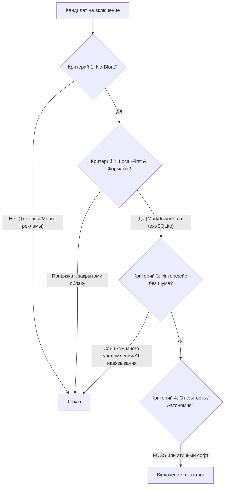

# Proposal 04: Каталог программ и инструментов для минималистов

Каталог инструментов **minimalist.lv** вдохновлен архитектурой и методологией проекта [Privacy Guides](https://www.privacyguides.org/), но сфокусирован на **минимализме, цифровой эффективности, независимости от платформ и отсутствии лишнего функционала (No Bloatware)**.

---

## 1. Философия отбора и критерии оценки (Inclusion Criteria)

Как и в Privacy Guides, проект не принимает платные размещения, рекламу или реферальные ссылки. Все рекомендации базируются на строгих, прозрачных и воспроизводимых критериях.



### 1.1. Базовые критерии включения (Must-Have):
1. **Легковесность и производительность (Low Footprint):**
   - Минимальное потребление ОЗУ и процессора в фоновом режиме.
   - Быстрый запуск (Startup time < 1–2 сек).
   - Предпочтение нативным приложениям или оптимизированным движкам перед тяжелыми контейнерами Electron (если есть достойная нативная альтернатива).
2. **Дизайн без отвлечений (Distraction-Free UI):**
   - Чистый, лаконичный интерфейс без навязчивых баннеров, подсказок «Попробуйте Premium» и мигающих элементов.
   - Отсутствие принудительно навязываемых функций (например, неотключаемые AI-кнопки в каждой строке).
3. **Local-First и открытые стандарты хранения данных:**
   - Данные пользователя хранятся локально в открытых форматах (`.txt`, `.md`, `.json`, `.sqlite`, `.csv`, `.pdf`).
   - Приложение работает на 100% офлайн без обязательного подключения к интернету.
   - Легкий экспорт и переносимость данных в один клик.
4. **Уважение к приватности и автономия (Zero Telemetry):**
   - Отсутствие инвазивной телеметрии и трекеров активности.
   - Предпочтение проектам с открытым исходным кодом (FOSS) или прозрачным лицензированием.
5. **Прозрачная модель монетизации (No Subscription Traps):**
   - Либо бесплатный Open Source, либо честная единоразовая покупка (Pay once, own forever), либо прозрачный self-hosted вариант.

### 1.2. Критерии исключения (Red Flags):
- Принудительная регистрация аккаунта для базовых локальных функций.
- «Feature-bloat»: разрастание приложения из простой утилиты в гигантский комбайн с маркетплейсом, криптой и неотключаемыми соцфункциями.
- Проприетарный закрытый формат файлов без возможности прямого чтения сторонними программами.
- Регулярные push-уведомления с маркетинговым содержанием.

---

## 2. Система статусов и бейджей (Badges & Scoring)

Каждому инструменту присваивается статус рекомендации:

| Бейдж | Название статуса | Описание |
| :--- | :--- | :--- |
| 🏆 **`Recommended`** | **Выбор редакции** | Золотой стандарт минимализма: FOSS, легковесный, идеальный UI, проверен годами. |
| ⚡ **`Lightweight Hero`** | **Экстремально легкий** | Минимальное потребление ресурсов (нативный C/Rust/Go или чистый CLI/TUI). |
| 💡 **`Notable Mention`** | **Достойная альтернатива** | Отличный софт с небольшими компромиссами (например, платный, но качественный). |
| 🧪 **`CLI / Advanced`** | **Для гиков и терминала** | Мощные клавиатурные и TUI-утилиты для максимальной скорости работы. |

---

## 3. Каталог категорий и рекомендуемый софт

```text
/tools/
├── operating-systems/      # Операционные системы и оконные менеджеры
├── text-and-writing/       # Текстовые редакторы и дистракшн-фри письмо
├── note-taking/            # Заметки, списки и персональные базы знаний
├── web-browsing/           # Легкие браузеры и утилиты чтения
├── communication/          # Почтовые клиенты, RSS и мессенджеры
├── task-management/        # Задачники, календари и учет времени
├── media-and-readers/      # Читалки книг/документов и медиаплееры
├── system-utilities/       # Файловые менеджеры, лаунчеры, поиск, бэкапы
└── hardware-and-edc/       # E-ink устройства, компактные клавиатуры, dumbphones
```

---

### РАЗДЕЛ 1: ТЕКСТОВЫЕ РЕДАКТОРЫ И ДИСТРАКШН-ФРИ ПИСЬМО

#### Рекомендованные инструменты:
- 🏆 **Ghostwriter** *(Linux, Windows / FOSS, C++/Qt)*
  - *Плюсы:* Идеальный полноэкранный режим без отвлечений, подсветка Hemingway Mode (нельзя стирать, только писать вперед), статистика скорости письма.
  - *Формат:* Чистый Markdown (`.md`).
- 🏆 **MarkText** *(Cross-platform / FOSS)*
  - *Плюсы:* Мгновенный WYSIWYG Markdown рендеринг без разделения экрана, строгий интерфейс.
- 💡 **iA Writer** *(macOS, iOS, Windows, Android / Проприетарный, разовая покупка)*
  - *Плюсы:* Эталонная типографика (шрифты iA Writer Duo/Mono), Focus Mode (подсветка текущего предложения или абзаца).
- ⚡ **FocusWriter** *(Cross-platform / FOSS, C++)*
  - *Плюсы:* Скрывает 100% интерфейса, имитирует печатную машинку, звуковые эффекты клавиш, таймеры сессий.
- 🧪 **Helix / Neovim Minimal** *(CLI, Rust / C)*
  - *Плюсы:* Запуск за 2 миллисекунды, управление только с клавиатуры, отсутствие мыши.

---

### РАЗДЕЛ 2: ЗАМЕТКИ И ПЕРСОНАЛЬНЫЕ БАЗЫ ЗНАНИЙ

#### Рекомендованные инструменты:
- 🏆 **Logseq** *(Cross-platform / FOSS, Local-First)*
  - *Плюсы:* Аутлайнер на базе локальных Markdown/Org-mode файлов, двунаправленные связи, полная приватность без обязательного облака.
- 🏆 **SilverBullet** *(Self-hosted / Web, FOSS, TypeScript)*
  - *Плюсы:* Сверхлегкая расширяемая база знаний в виде чистых Markdown файлов с веб-интерфейсом.
- 💡 **Obsidian (в минималистичном профиле)** *(Cross-platform / Freeware, Local Markdown)*
  - *Плюсы:* Огромная экосистема, но при отключении лишних плагинов превращается в чистый, быстрый и неубиваемый инструмент для заметок.
- ⚡ **Plain Text / Foam / VS Code Minimal** *(Markdown files + ripgrep / CLI)*
  - *Плюсы:* Самый надежный формат во Вселенной: папка с файлами `.txt` и `.md`, читаемая на любом устройстве через 50 лет.
- 💡 **Simplenote** *(Cross-platform / FOSS клиенты)*
  - *Плюсы:* Абсолютная простота: только текст, теги, поиск и мгновенная синхронизация без форматирования и перегруза.

---

### РАЗДЕЛ 3: ВЕБ-БРАУЗИНГ И ЧТЕНИЕ БЕЗ МУСОРА

#### Рекомендованные инструменты:
- 🏆 **Firefox (в конфигурации Arkenfox / Minimal UI)** *(Cross-platform / FOSS)*
  - *Плюсы:* Независимый движок Gecko, скрытые лишние панели, встроенный режим чтения (Reader View), блокировка всей рекламы через uBlock Origin.
- ⚡ **Min Browser** *(Cross-platform / FOSS)*
  - *Плюсы:* Минималистичный браузер, где вкладки занимают минимум места, встроенный блокировщик рекламы и трекеров, режим Focus Mode (скрывает другие вкладки).
- 🧪 **qutebrowser / Nyxt** *(Cross-platform / FOSS, Python/Lisp)*
  - *Плюсы:* Управление вкладками и ссылками через клавиши (Vim-style hints) без прикосновения к трекпаду.
- 🏆 **uBlock Origin (В режиме Medium Mode)** *(Расширение / FOSS)*
  - *Плюсы:* Устранение до 99% мусора, всплывающих окон, баннеров подписки и автовоспроизведения видео в сети.

---

### РАЗДЕЛ 4: ИНФОРМАЦИОННАЯ ДИЕТА, RSS И ЧТЕНИЕ ПОЗЖЕ

#### Рекомендованные инструменты:
- 🏆 **NetNewsWire** *(macOS, iOS / FOSS, Swift)*
  - *Плюсы:* Молниеносный, нативный, великолепный дизайн Apple-экосистемы, 0 лишних функций.
- 🏆 **Feeder / NewsFlash** *(Android / Linux / FOSS)*
  - *Плюсы:* Чистое чтение RSS-лент без алгоритмов рекомендаций и навязчивых предложений.
- ⚡ **Omnivore / Wallabag** *(FOSS, Self-hostable)*
  - *Плюсы:* Открытая замена Pocket и Instapaper: сохранение статей в чистом тексте для медленного чтения офлайн.
- 🧪 **Newsboat** *(CLI / FOSS, C++)*
  - *Плюсы:* Чтение новостей прямо в терминале с фильтрацией через регулярные выражения.

---

### РАЗДЕЛ 5: УПРАВЛЕНИЕ ЗАДАЧАМИ, КАЛЕНДАРИ И ВРЕМЯ

#### Рекомендованные инструменты:
- 🏆 **Todo.txt (Формат и приложения: Markor / Sleek / SimpleTask)** *(FOSS)*
  - *Плюсы:* Весь список дел хранится в одном текстовом файле `todo.txt`. Максимальная долговечность и переносимость.
- 🏆 **Super Productivity** *(Cross-platform / FOSS)*
  - *Плюсы:* Трекер задач и таймер Pomodoro без привязки к аккаунтам, хранение данных локально или в WebDAV/Dropbox.
- ⚡ **Calcurse** *(CLI / FOSS, C)*
  - *Плюсы:* Текстовый календарь и планировщик задач для терминала.
- 💡 **Things 3** *(macOS, iOS / Проприетарный, разовая покупка)*
  - *Плюсы:* Эталон визуального спокойствия и простоты интерфейса среди графических менеджеров задач.

---

### РАЗДЕЛ 6: СИСТЕМНЫЕ УТИЛИТЫ, ФАЙЛЫ И ПОИСК

#### Рекомендованные инструменты:
- 🏆 **Yazi / lf / Ranger** *(CLI / FOSS, Rust / Go / Python)*
  - *Плюсы:* Сверхбыстрые терминальные файловые менеджеры с предпросмотром картинок и текстов без загрузки тяжелого GUI.
- 🏆 **FSearch (Linux) / Everything (Windows) / Raycast (macOS)**
  - *Плюсы:* Мгновенный поиск файлов по первому символу без индексации, пожирающей процессор.
- ⚡ **Kopia / Restic / BorgBackup** *(CLI / FOSS)*
  - *Плюсы:* Минималистичное, надежное шифрованное резервное копирование по принципу «настроил и забыл».
- 🏆 **BleachBit** *(Cross-platform / FOSS)*
  - *Плюсы:* Очистка системы от временных файлов, кэша браузеров и мусора без фоновых служб-оптимизаторов.

---

### РАЗДЕЛ 7: МЕДИА, ЧТЕНИЕ КНИГ И ДОКУМЕНТОВ

#### Рекомендованные инструменты:
- 🏆 **Zathura** *(Linux / FOSS, C)*
  - *Плюсы:* Сверхлегкий просмотрщик PDF/EPUB/DjVu с клавиатурным управлением и инверсией цветов для ночного чтения.
- 🏆 **Foliate** *(Linux / FOSS, GTK4)*
  - *Плюсы:* Красивая электронная читалка книг с поддержкой настроек шрифтов, словарей и чистым режимом без панелей.
- 🏆 **mpv** *(Cross-platform / FOSS, C)*
  - *Плюсы:* Медиаплеер без тяжелой графической оболочки — только видео, аппаратное ускорение и горячие клавиши.
- ⚡ **KOReader** *(E-ink, Android, Linux / FOSS)*
  - *Плюсы:* Оптимизированная программа для чтения на ридерах и смартфонах с гибкой настройкой отображения страниц.

---

### РАЗДЕЛ 8: АППАРАТНОЕ ОБЕСПЕЧЕНИЕ И EDC МИНИМАЛИСТА

#### Рекомендованные устройства:
- 🏆 **E-Ink ридеры с открытым Android (Onyx Boox Palma / Poke, Kobo)**:
  - Экраны без синего свечения и мерцания для чтения лонгридов и работы с текстом без соцсетевых соблазнов.
- 💡 **Dumbphones / Минималистичные телефоны (Light Phone II, Punkt MP02, Mudita Pure, Unihertz Jelly)**:
  - Устройства только для звонков, SMS и навигации, освобождающие от экранной зависимости.
- ⚡ **Минималистичные лаунчеры для смартфонов (Olauncher, Before Launcher, Niagara Launcher / FOSS / Android)**:
  - Текстовый список приложений вместо красочных иконок, снижающий компульсивное открывание телефона.

---

## 4. Спецификация и шаблон карточки инструмента (MDX Template)

Каждый инструмент в репозитории оформляется отдельным файлом в папке `src/content/tools/items/{slug}.mdx`:

```markdown
---
name: "Ghostwriter"
tagline: "Дистракшн-фри текстовый редактор Markdown для полного погружения в процесс письма"
category: "text-and-writing"
websiteUrl: "https://ghostwriter.kde.org/"
sourceCodeUrl: "https://invent.kde.org/office/ghostwriter"
isOpenSource: true
isOfflineFirst: true
isZeroTelemetry: true
license: "GPL-3.0"
platforms: ["linux", "windows"]
recommendationStatus: "recommended"
pros:
  - "Полноэкранный режим без единого элемента интерфейса"
  - "Режим Hemingway Mode блокирует клавишу Backspace для непрерывного письма"
  - "Мгновенное сохранение в стандартный файл .md"
  - "Низкое потребление памяти благодаря нативному Qt/C++ коду"
cons:
  - "Нет официального порта под macOS (доступен только через Homebrew сборки)"
  - "Ограничен базовым редактированием текста (не подходит для сложного верстания)"
minimalistVerdict: "Идеальный инструмент для авторов лонгридов и статей, желающих писать без отвлечений на форматирование."
---

### Почему мы рекомендуем Ghostwriter
Ghostwriter разработан специально для того, чтобы убрать барьер между мыслями автора и чистым текстом на экране...

#### Ключевые особенности настройки:
1. Включите режим **Focus Mode** в меню настроек (`F11`).
2. Настройте тему оформления *Dark Dimmed* для снижения усталости глаз.
```

---

## 5. Интерактивные фильтры каталога (UI/UX)

На страницах каталога (`/tools/`) реализована быстрая клиентская фильтрация без перезагрузки:
- **Фильтр по платформам:** `[ All ]` `[ Linux ]` `[ macOS ]` `[ Windows ]` `[ Android ]` `[ iOS ]` `[ CLI ]`
- **Фильтр по лицензии:** `[ Open Source Only ]`
- **Фильтр по статусу:** `[ 🏆 Рекомендованные ]` `[ ⚡ Легковесные ]` `[ 🧪 CLI ]`
- **Поиск по свойствам:** мгновенный поиск через Pagefind по названию, тегам и форматам файлов.
