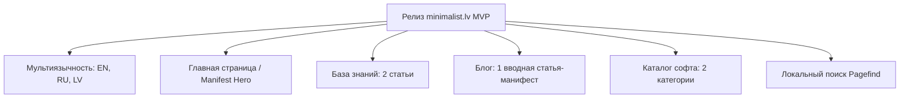

# Proposal 05: План реализации MVP (Minimal Viable Product)

## 1. Цели и границы MVP (Scope of MVP)

Цель MVP — создать полностью функционирующий, готовый к публикации статический сайт **minimalist.lv**, демонстрирующий все ключевые функциональные разделы, дизайн-систему, типографику и мультиязычность на трех обязательных языках (**English**, **Русский**, **Latviešu**).



---

## 2. Состав контента в MVP (на 3 языках)

Весь контент MVP будет сразу доступен на **EN**, **RU** и **LV** (суммарно 15 страниц контента):

### 2.1. Главная страница (`/en/`, `/ru/`, `/lv/`)
- **Hero-блок:** Лаконичный манифест минимализма, слоган сайта и кнопка перехода к чтению базы знаний.
- **Быстрый доступ к 3 разделам:**
  - *База знаний (Guides)* — структурированные руководства.
  - *Каталог софта (Tools)* — этичный, легковесный софт без мусора.
  - *Блог (Blog)* — еженедельные короткие эссе о простоте.
- **Индикатор миссии:** Zero tracking, 100% static, Local-first, open-source.

---

### 2.2. База знаний (2 фундаментальные статьи)

#### Статья 1: Философия и основы
- **EN:** `01-minimalism-manifesto.md` — *"The Minimalism Manifesto: Making Room for What Matters"*
- **RU:** `01-manifest-minimalizma.md` — *"Манифест минимализма: Освобождение места для важного"*
- **LV:** `01-minimalisma-manifests.md` — *"Minimālisma manifests: Atbrīvojot vietu svarīgajam"*
- **Суть:** Вводный лонгрид о том, что такое минимализм, избавление от шума, интенциональная жизнь и снижение стресса.

#### Статья 2: Цифровой минимализм
- **EN:** `02-digital-hygiene-principles.md` — *"Digital Hygiene: Reclaiming Autonomy from Algorithms"*
- **RU:** `02-principy-cifrovoj-gigieny.md` — *"Принципы цифровой гигиены: Возвращение контроля над вниманием"*
- **LV:** `02-digitalas-higienas-pamatprincipi.md` — *"Digitālās higiēnas pamatprincipi: Uzmanības kontroles atgūšana"*
- **Суть:** Практическое руководство по снижению цифрового шума, настройке уведомлений и созданию спокойного инфополя.

---

### 2.3. Блог (1 вводная статья-приветствие)
- **EN:** `welcome-to-minimalist-lv.md` — *"Welcome to Minimalist.lv: Why We Built This Space"*
- **RU:** `dobro-pozhalovat-v-minimalist-lv.md` — *"Добро пожаловать в Minimalist.lv: Зачем создан этот проект"*
- **LV:** `laipni-lugti-minimalist-lv.md` — *"Laipni lūgti Minimalist.lv: Kāpēc mēs izveidojām šo vietni"*
- **Роль в MVP:** Служит манифестом блога, объясняет формат еженедельных 5-минутных эссе и остается постоянным приветственным постом в истории блога.

---

### 2.4. Каталог программ и инструментов (2 категории)

#### Категория 1: Текстовые редакторы и дистракшн-фри письмо (`/tools/text-and-writing/`)
- Описание категории и критериев оценки текстовых редакторов.
- Карточки инструментов:
  - 🏆 **Ghostwriter** (FOSS, Markdown, Focus Mode, Hemingway Mode)
  - 🏆 **MarkText** (FOSS, чистый WYSIWYG Markdown)
  - 💡 **iA Writer** (Эталонная типографика, Focus Mode)
  - ⚡ **FocusWriter** (Полноэкранный режим печатной машинки)
  - 🧪 **Helix** (CLI / Rust, мгновенный старт без мыши)

#### Категория 2: Заметки и персональные базы знаний (`/tools/note-taking/`)
- Описание категории (Local-First vs Cloud Lock-in).
- Карточки инструментов:
  - 🏆 **Logseq** (FOSS, Local-First аутлайнер на Markdown)
  - 🏆 **SilverBullet** (FOSS, расширяемый Markdown-ноутпад)
  - 💡 **Obsidian Minimal** (Локальный Markdown с минимальным набором плагинов)
  - ⚡ **Plain Text Notes** (Универсальная связка `notes.md` + grep)

---

## 3. Техническая реализация и архитектура MVP

### 3.1. Стек MVP
- **Фреймворк:** Astro 5 (TypeScript, Island Architecture, Zero JS by default)
- **Стилизация:** Чистый Tailwind CSS v4 или Vanilla CSS Modules с минималистичными токенами типографики.
- **Типизация контента:** Astro Content Collections (схемы Zod для `guides`, `blog`, `tools`, `categories`).
- **Поиск:** Pagefind (статический мультиязычный поисковый индекс, собираемый на этапе build).
- **Сборка и развертывание:** GitHub Actions -> Cloudflare Pages (с доменом `minimalist.lv`).

### 3.2. Архитектура маршрутов (Routing)
```text
/                                   -> Редирект на /{detected_lang}/ (fallback: /en/)
/[lang]/                            -> Главная страница
/[lang]/guides/                     -> Список статей базы знаний
/[lang]/guides/[slug]/              -> Страница статьи с оглавлением (TOC)
/[lang]/blog/                       -> Список постов блога
/[lang]/blog/[slug]/                -> Страница поста блога
/[lang]/tools/                      -> Главная страница каталога инструментов
/[lang]/tools/[category]/           -> Страница категории инструментов с карточками
/[lang]/about/                      -> Манифест проекта и критерии отбора
```

---

## 4. Этапы разработки (Milestones)

### Этап 1: Инициализация ядра и дизайн-системы (1–2 дня)
- [ ] Инициализация Astro проекта (`package.json`, `tsconfig.json`, `astro.config.mjs`).
- [ ] Настройка дизайн-системы: шрифты (Geist / Inter), палитра монохром, темная/светлая тема.
- [ ] Базовые UI-компоненты: `Header`, `Footer`, `LanguageSwitcher`, `ThemeToggle`, `SEOHead`.

### Этап 2: i18n и Content Collections (1 день)
- [ ] Настройка словарей интерфейса (`src/i18n/ui.ts` для EN, RU, LV).
- [ ] Определение Zod-схем в `src/content/config.ts` (`guides`, `blog`, `tools`, `categories`).
- [ ] Создание хелперов маршрутизации и связывания hreflang.

### Этап 3: Наполнение контентом MVP (2 дня)
- [ ] Написание и перевод 2 статей базы знаний (EN, RU, LV).
- [ ] Написание и перевод 1 приветственного поста блога (EN, RU, LV).
- [ ] Создание 2 категорий софта и карточек инструментов с бейджами и вердиктами (EN, RU, LV).
- [ ] Верстка главной страницы с манифестом.

### Этап 4: Поиск, Оптимизация и Деплой (1 день)
- [ ] Интеграция Pagefind для мгновенного поиска по всему контенту.
- [ ] Проверка Lighthouse: обеспечение 100/100 баллов по Performance, Accessibility, SEO.
- [ ] Настройка GitHub Actions Workflow для сборки и автоматического деплоя на Cloudflare Pages.

---

## 5. Чек-лист готовности MVP к запуску (Definition of Done)
1. Все страницы открываются без ошибок 404 на `/en/`, `/ru/` и `/lv/`.
2. Переключатель языка корректно переводит пользователя на соответствующую страницу текущего материала.
3. Поиск Pagefind находит термины на всех трех языках.
4. Валидация Frontmatter через Zod проходит без предупреждений (`npm run build`).
5. Темная и светлая темы работают плавно без мерцания при загрузке страницы.
6. В репозитории созданы `README.md`, `AGENTS.md` и `CLAUDE.md`.
