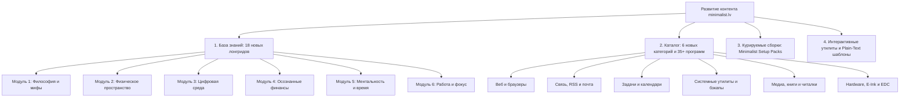

# Proposal 06: План развития контента базы знаний и каталога инструментов (Roadmap)

## 1. Введение и цели расширения контента

После успешного запуска MVP (Главная страница, 2 статьи базы знаний, 1 пост блога и 2 категории каталога инструментов на 3 языках) данный документ определяет стратегию и пошаговый план наполнения **основного не-блогового контента** портала **minimalist.lv**:

1. **Завершение Базовой базы знаний (Core Knowledge Base):** написание оставшихся **18 фундаментальных руководств** (из 20 запланированных) на английском, русском и латышском языках.
2. **Расширение каталога программ и инструментов (Tools Directory):** добавление **6 новых категорий** и более **35 проверенных инструментов**, матриц сравнения и конфигурационных гайдов.
3. **Интерактивные статические утилиты и шаблоны (Interactive Minimalist Utilities):** создание легковесных локальных виджетов (дерево решений о покупках, калькулятор расхламления, plain-text шаблоны).
4. **Готовые наборы инструментов («Minimalist Setup Bundles»):** курируемые сборки софта под конкретные сценарии (Писатель, Разработчик, Студент, Digital Nomad).



---

## 2. Поэтапный план базы знаний (18 оставшихся статей)

Все статьи пишутся синхронно на **EN**, **RU** и **LV**, валидируются схемой `guides` в `src/content/config.ts` и снабжаются практическими чек-листами.

### Волна 1: Физическое пространство, дом и гардероб (Статьи 03–08)
*Фокус: материальный мир, остановка притока хлама и освобождение жилого пространства.*

- **Статья 03. Мифы, крайности и ловушки псевдоминимализма**
  - *Суть:* Разоблачение культа белых пустых стен, вины за памятные вещи и дорогого «эстетического консьюмеризма».
- **Статья 04. Аудит жизни и определение ключевых ценностей**
  - *Суть:* Построение персонального ценностного фильтра: тест «Если это не абсолютное ДА, то это твердое НЕТ».
- **Статья 05. Полная методология расхламления: Пошаговый алгоритм**
  - *Суть:* Сравнение методов КонМари, 4 коробок и «Packing Party». Борьба с эффектом невозвратных затрат (*Sunk Cost Fallacy*).
- **Статья 06. Архитектура чистого дома: Организация без накопления**
  - *Суть:* Правило «У каждой вещи один дом», концепция чистых плоских поверхностей, отказ от покупки лишних контейнеров.
- **Статья 07. Капсульный гардероб: Универсальный подход к одежде**
  - *Суть:* Избавление от утренней усталости от решений, сборка базы из 25–35 качественных сочетаемых вещей, проект 333.
- **Статья 08. Минимализм и устойчивость: Zero Waste и циклическая экономика**
  - *Суть:* Иерархия 5R (Refuse, Reduce, Reuse...), экологичная утилизация, переработка электроники в ЕС и Балтии.

---

### Волна 2: Цифровой суверенитет и инфодиета (Статьи 10–12)
*Фокус: наведение порядка в данных, файловых хранилищах и фильтрация входящей информации.*

- **Статья 10. Смартфон как полезный инструмент, а не слот-машина**
  - *Суть:* Архитектура нулевого главного экрана, запуск через ввод, удаление соцсетей со смартфонов.
- **Статья 11. Наведение порядка в файлах, облаках и цифровом архиве**
  - *Суть:* Методология PARA (Projects, Areas, Resources, Archive), плоская структура против 10-уровневых папок, чистка фотоархивов.
- **Статья 12. Информационная диета и управление входящим потоком**
  - *Суть:* Концепция низкоинформационной диеты (Рольф Добелли), RSS против алгоритмических лент, медленное чтение.

---

### Волна 3: Осознанные финансы и потребление (Статьи 13–15)
*Фокус: психологические триггеры покупок, финансовая подушка безопасности и покупка времени вместо вещей.*

- **Статья 13. Психология потребления: Как победить импульсивные покупки**
  - *Суть:* Гедонистическая беговая дорожка, эффект Дидро, буферный список желаний (правило 72 часов), расчет цены вещи в часах труда.
- **Статья 14. Минималистичное бюджетирование и финансовая автономия**
  - *Суть:* Одностраничный бюджет, автоматизация накоплений («Заплати сначала себе»), аудит подписок, концепция FIRE.
- **Статья 15. Инвестиции в опыт и развитие вместо материальных объектов**
  - *Суть:* Исследования Томаса Гиловича (Корнелл): почему впечатления и навыки приносят долгосрочное счастье, а вещи — нет.

---

### Волна 4: Время, отношения и глубокая работа (Статьи 16–20)
*Фокус: защита личных границ, замедление темпа жизни и максимальный фокус в профессии.*

- **Статья 16. Искусство говорить «Нет»: Расхламление календаря и обязательств**
  - *Суть:* Эссенциализм Грега МакКеона, вежливые скрипты отказов, белое пространство в расписании.
- **Статья 17. Ментальный детокс: Практика тишины, созерцания и замедления**
  - *Суть:* Уединение (*Solitude Deprivation*), прогулки без наушников, ведение дневника (Brain Dump), движение Slow Living.
- **Статья 18. Минимализм в отношениях: Качество вместо количества**
  - *Суть:* Число Данбара, сокращение истощающих поверхностных связей, культура неделимого внимания (*Undivided Attention*).
- **Статья 19. Минималистичное рабочее место: Эргономика и свобода от отвлечений**
  - *Суть:* Чистый стол, кабель-менеджмент, мобильный сетап для работы из любой точки мира.
- **Статья 20. Фокус и глубокая работа: Продуктивность через сокращение**
  - *Суть:* Концепция Deep Work (Кэл Ньюпорт), цена переключения контекста, «Правило 3 главных задач» на день.

---

## 3. Расширение каталога программ (6 новых категорий)

Каждая категория будет оформлена отдельной страницей (`/tools/{category}/`) с фильтрами, карточками и сравнительной таблицей параметров.

```text
src/content/tools/
├── web-browsing/           # Браузинг и чтение
├── communication/          # Почта, RSS и мессенджеры
├── task-management/        # Задачники и календари
├── system-utilities/       # Системные утилиты и поиск
├── media-and-readers/      # Читалки и плееры
└── hardware-and-edc/       # Устройства, E-Ink и лаунчеры
```

### Категория 3: Веб-браузинг и чистое чтение (`web-browsing`)
- 🏆 **Firefox (в профиле Arkenfox / user.js)** — Gecko-движок, максимальная приватность, скрытые лишние панели.
- ⚡ **Min Browser** — Минималистичный браузер с режимом Focus Mode и встроенной блокировкой рекламы.
- 💡 **LibreWolf** — Независимый форк Firefox без телеметрии и рекламы из коробки.
- 🧪 **qutebrowser** — Легковесный клавиатурный браузер с Vim-навигацией.
- 🏆 **uBlock Origin (Medium Mode)** — Золотой стандарт фильтрации рекламного и визуального мусора.

### Категория 4: Связь, RSS и почтовые клиенты (`communication`)
- 🏆 **NetNewsWire** (macOS, iOS) — Молниеносный нативный RSS-клиент без алгоритмов.
- 🏆 **Feeder / NewsFlash** (Android, Linux) — Чистое чтение RSS-лент с офлайн-кэшированием.
- ⚡ **Delta Chat** — Мессенджер поверх стандартного протокола e-mail без центрального сервера.
- 💡 **Signal** — Безопасный мессенджер без рекламы и сбора метаданных.
- 🧪 **Neomutt / Aerc** (CLI) — Мощные текстовые почтовые клиенты для терминала.
- ⚡ **Omnivore / Wallabag** — FOSS-инструменты для сохранения статей и отложенного чтения офлайн.

### Категория 5: Управление задачами, календари и привычки (`task-management`)
- 🏆 **Todo.txt (Markor / Sleek / SimpleTask)** — Задачи в одном долговечном текстовом файле `todo.txt`.
- 🏆 **Super Productivity** — FOSS-трекер задач и Pomodoro без обязательных аккаунтов.
- ⚡ **Calcurse** — Текстовый календарь и планировщик для CLI.
- 💡 **Things 3** (macOS, iOS) — Эталон визуального спокойствия среди графических таск-менеджеров.
- ⚡ **Loop Habit Tracker** (Android, FOSS) — Простой трекер привычек без рекламы и подписок.

### Категория 6: Системные утилиты, поиск и резервное копирование (`system-utilities`)
- 🏆 **Yazi / lf / Ranger** (CLI) — Сверхбыстрые файловые менеджеры на Rust/Go с предпросмотром.
- 🏆 **FSearch (Linux) / Everything (Windows) / Raycast (macOS)** — Мгновенный поиск файлов по первой букве.
- ⚡ **Kopia / Restic / BorgBackup** — Автономное шифрованное инкрементальное резервное копирование.
- 🏆 **BleachBit** — Очистка системы от временного мусора и кэша без фоновых служб.
- ⚡ **Syncthing** — P2P синхронизация файлов между вашими устройствами без сторонних облаков.

### Категория 7: Чтение книг, документов и медиа (`media-and-readers`)
- 🏆 **Zathura** (Linux, C) — Минималистичный ридер PDF/EPUB с управлением с клавиатуры.
- 🏆 **Foliate** (Linux, GTK4) — Чистая читалка электронных книг с идеальной типографикой.
- 🏆 **mpv** (Cross-platform) — Медиаплеер без тяжелой графической оболочки.
- ⚡ **KOReader** (E-ink, Android, Linux) — Оптимизированный софт для чтения на электронных книгах.
- 🧪 **cmus** (CLI) — Сверхлегкий аудиоплеер для локальной музыки.

### Категория 8: Минималистичные устройства, E-Ink и EDC (`hardware-and-edc`)
- 🏆 **Onyx Boox Palma / Poke** — E-ink устройства карманного формата для чтения без синего свечения и бликов.
- 💡 **Light Phone II / Mudita Pure / Punkt MP02** — Телефоны только для звонков и сообщений.
- ⚡ **Olauncher / Before Launcher / Niagara** (Android, FOSS) — Минималистичные текстовые лаунчеры без иконок.
- 🏆 **Компактные 60% / 65% механические клавиатуры** — Освобождение места на столе и правильная эргономика.

---

## 4. Курируемые сборки («Minimalist Setup Packs»)

Для удобства пользователей создается раздел готовых проверенных комплектов программ под ключевые роли:

| Название набора | Целевая аудитория | Рекомендуемый стек |
| :--- | :--- | :--- |
| ✍️ **The Writer Pack** | Писатели, журналисты, блогеры | Ghostwriter / iA Writer + Foliate + NetNewsWire + Syncthing |
| 🧠 **The Thinker / PKM Pack** | Исследователи, студенты, ученые | Logseq / SilverBullet + Zathura + Todo.txt + Kopia |
| 💻 **The Minimalist Dev Pack** | Программисты, системные инженеры | Helix / Neovim + Yazi + Alacritty/Foot + BorgBackup |
| 📱 **The Digital Detox EDC** | Желающие избавиться от экранного рабства | Boox Palma + Olauncher + Signal + Local plain-text notes |

---

## 5. Интерактивные статические утилиты (Zero-JS / Local-First)

План добавления интерактивных инструментов, работающих на 100% в браузере пользователя без отправки данных на сервер:

### 5.1. «Стоит ли это покупать?» (Interactive Purchase Flowchart)
- Интерактивное пошаговое дерево из 5 вопросов перед любой покупкой:
  1. *Есть ли у меня вещь, закрывающая эту потребность хотя бы на 80%?*
  2. *Готов ли я заплатить за это [X] часов своей работы?*
  3. *Где именно эта вещь будет храниться физически?*
  4. *Буду ли я пользоваться этим через 6 месяцев?*
  5. *Прошло ли 72 часа с момента первого желания?*
- Результат: Четкая рекомендация (Покупать / Отложить в Wishlist / Отказаться).

### 5.2. Генератор Plain-Text шаблонов
- Онлайн-конструктор для копирования готовых шаблонов:
  - Шаблон `todo.txt` с правильной расстановкой приоритетов и контекстов.
  - Шаблон одностраничного бюджета в формате Markdown/CSV.
  - Шаблон персонального вишлиста с таймером ожидания 30 дней.

### 5.3. 15-минутный таймер расхламления (Declutter Sprint Widget)
- Легковесный таймер со случайным заданием (например: *«Разберите верхний ящик письменного стола»*, *«Удалите дубликаты фото за прошлый месяц»*, *«Отпишитесь от 5 рассылок»*).

---

## 6. График и приоритеты реализации (Release Timeline)

| Этап | Содержание релиза | Ожидаемый результат |
| :--- | :--- | :--- |
| **Этап 1 (Sprint 1)** | База знаний: Волна 1 (Статьи 03–08: Дом, расхламление, гардероб, экология) + 2 новые категории софта (Браузинг и Связь/RSS). | 8 статей базы знаний, 4 категории софта. |
| **Этап 2 (Sprint 2)** | База знаний: Волна 2 (Статьи 10–12: Цифровой порядок и инфодиета) + Категории Задачи/Календари и Системные утилиты. | 11 статей базы знаний, 6 категорий софта. |
| **Этап 3 (Sprint 3)** | База знаний: Волна 3 (Статьи 13–15: Финансы и осознанное потребление) + Категории Медиа/Читалки и Hardware/EDC. | 14 статей базы знаний, все 8 категорий софта (полный каталог). |
| **Этап 4 (Sprint 4)** | База знаний: Волна 4 (Статьи 16–20: Время, тишина, отношения, Deep Work) + Интерактивные утилиты (Purchase Decision Tree) и Setup Packs. | Полная база знаний (20/20 статей), 8 категорий софта, интерактивные утилиты. |
